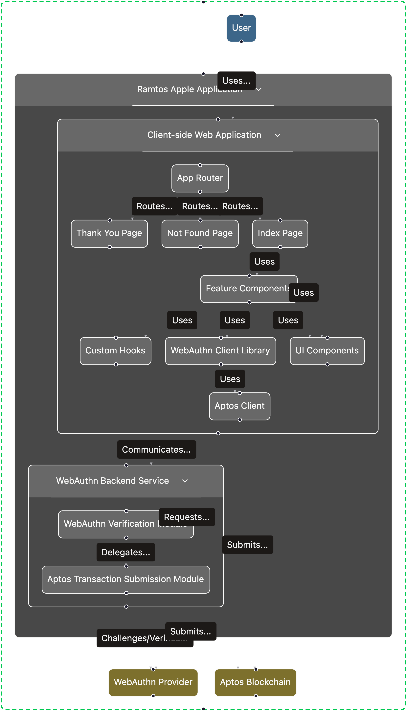

# Ramtos



## Getting Started

To get a local copy up and running, follow these simple steps.

### Prerequisites

- [Node.js](https://nodejs.org/) (v18 or later)
- [npm](https://www.npmjs.com/) or [yarn](https://yarnpkg.com/)


### Running the Application

To start the development server, run:

```sh
npm run dev
```

Open [http://localhost:5173](http://localhost:5173) to view it in the browser.

## Project Structure

The `src` directory is organized as follows:

-   **`components/`**: This directory contains all the reusable UI components used throughout the application.
    -   **`ui/`**: Sub-directory for UI components from `shadcn/ui`.
-   **`hooks/`**: This directory holds custom React hooks that encapsulate and reuse stateful logic.
-   **`lib/`**: This directory is for utility functions, helper scripts, and configurations for external libraries.
-   **`pages/`**: This directory contains the top-level components for each page, which are mapped to different routes in the application.
-   **`App.tsx`**: The main application component where routing is set up.
-   **`main.tsx`**: The entry point of the application where the React app is rendered.
